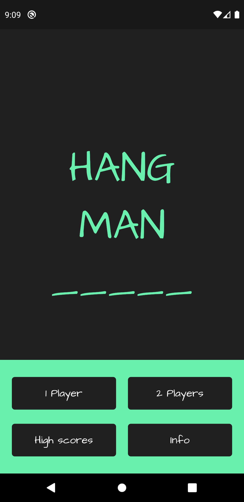
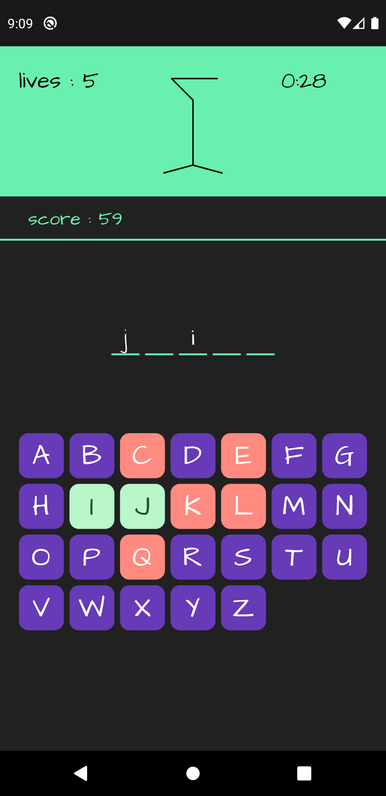
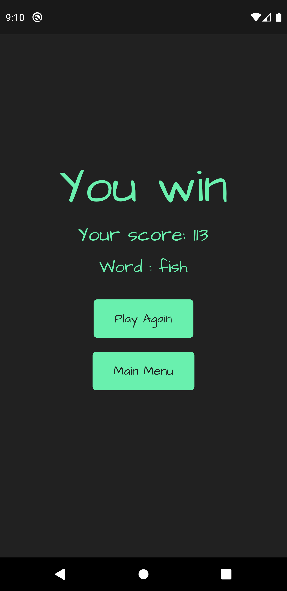
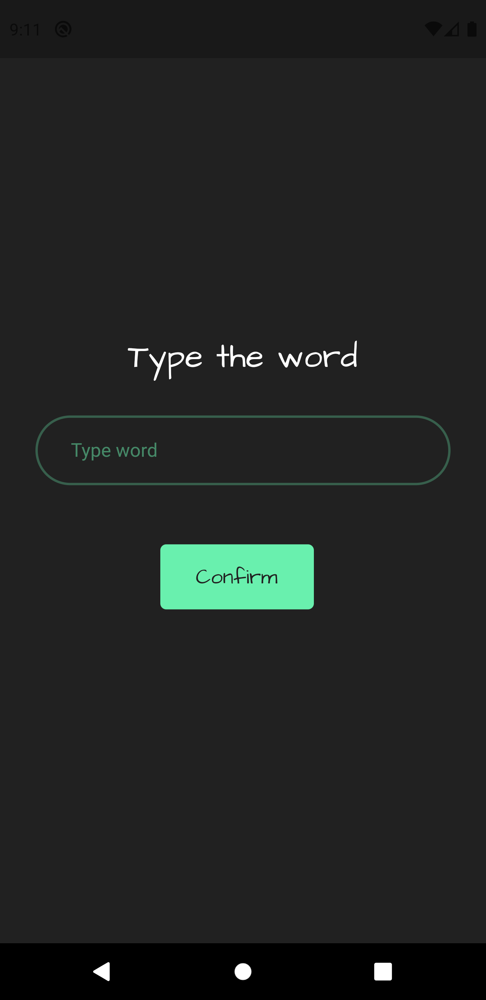
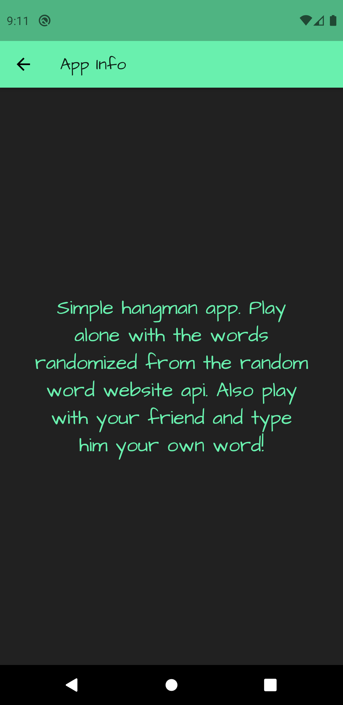

# Hangman
### Hangman Game in Flutter

A new Flutter application.

## Getting Started

A few resources to get you started if this is your first Flutter project:
- [Lab: Write your first Flutter app](https://flutter.dev/docs/get-started/codelab)
- [Cookbook: Useful Flutter samples](https://flutter.dev/docs/cookbook)

For help getting started with Flutter, view our
[online documentation](https://flutter.dev/docs), which offers tutorials, samples, guidance on mobile development, and a full API reference.

#### Used features:
- flutter material design library
- flutter http library [link](https://pub.dev/packages/http)
- flutter cupertino icons library [link](https://pub.dev/packages/cupertino_icons)
- flutter shared preferences library [link](https://pub.dev/packages/shared_preferences)

#### Used technology
- async tasks
- build listview
- use maps and lists
- custom classes and widgets
- using forms, dialogs, input decorations
- save data to shared preferences
- navigation with named routes
- get word from api

## Screenshots :

## Thanks for reading. Don't forget to star my project
